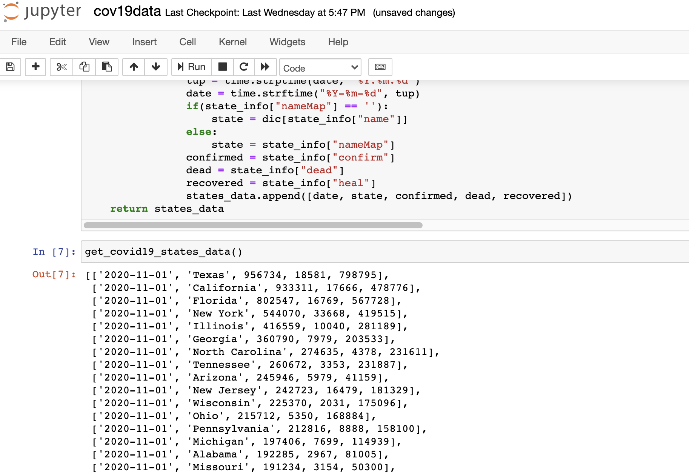
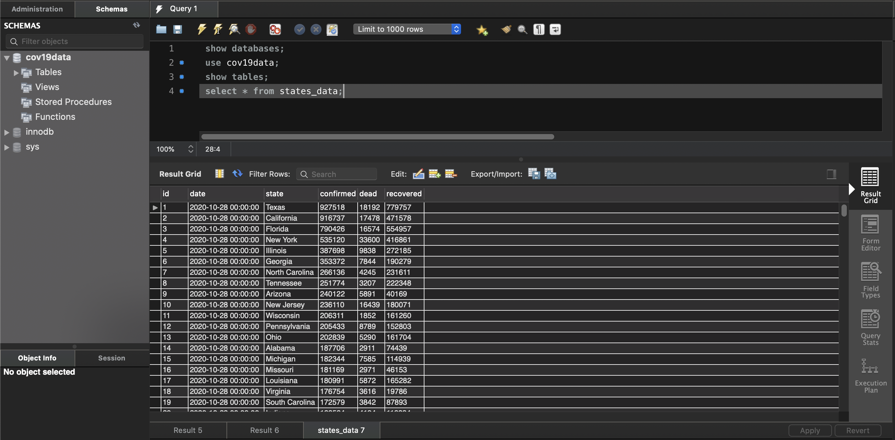
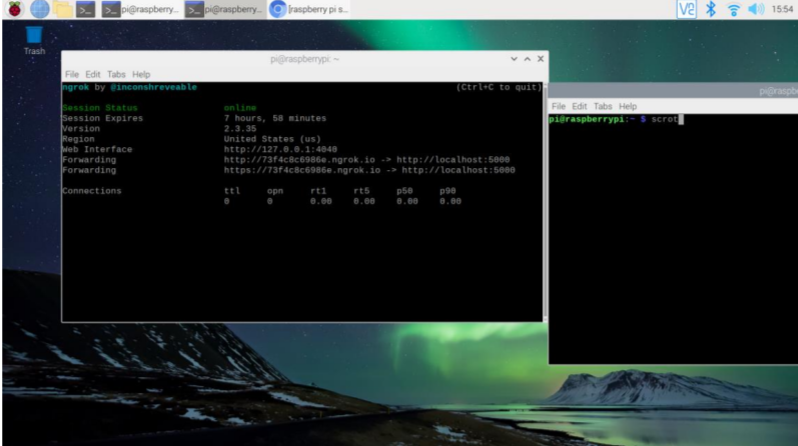
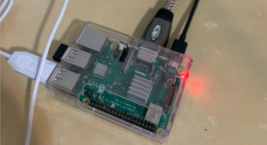
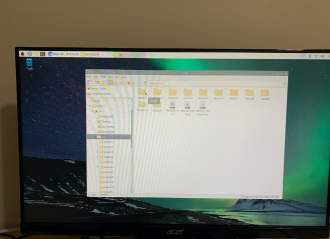

# IoT-EE629

### Report 11 2020/12/11
Added more content in the project's README.md

### Report 10 2020/12/6
1. Learned the basics of TypeScript last week and understood the difference and connection between it and JavaScript.
2. Watched a small part of AWS re:Invent virtual conference.

### Report 9 2020/11/14
1. Elsa, a new entrant in the arena, is a minimal, fast and secure runtime for JavaScript and TypeScript written in Go. Now, we have Node, [Deno](https://en.wikipedia.org/wiki/Deno_(software)) and [Elsa](https://github.com/elsaland/elsa).
2. My project is a COVID-19 Tracker application with Flask hosted on AWS.

### Report 8 2020/11/01
1. Finished Lab 7A: ThingSpeak, Lab7B: Google Sheets
2. Finished data scrapping, tested data in local machine MySQL database, and then stored data in the Amazon RDS MySQL database.

3. Finished project front-end part.

### Report 7 2020/10/25
1. Finished Lab 5A, 5B.
2. Project: Completed data acquisition and classification.

### Report 6 2020/10/17
###### 1. Applebot 
What is Applebot? A web crawler for Apple. Products like Siri and Spotlight Suggestions use Applebot. So users don't have to rely on third-party tools like Google, Bing to search what they need. Compared to the big boy Googlebot, which is the famous web crawler, Applebot may never be able to compete with it, but judging from the release of ARM-based Apple silicon this year, Apple has this ambition to further expand its ecosystem.

###### 2. Googlebot will soon speak HTTP/2
Starting November 2020, Googlebot will start crawling some sites over HTTP/2.

What is [HTTP/2][HTTP/2]?

###### 3. Project Process
Completed the first part of data crawling.

[HTTP/2]: https://en.wikipedia.org/wiki/HTTP/2

### Report 5 2020/10/13
1. Practiced basic web scraping library: Requests, Beautiful Soup 4, Selenium(but met some problem).
2. Noticed that Raspberry Pi can not use Chrome, until now can not find same version chromium driver for selenium.
3. Previewed class 5.

### Report 4 2020/10/13
1.Completed the Lab4 A,B,C,D.
2.Created test MySQL database and several tables.

3.Installed Jupyter Notebook for project.

4.Started Project with Python.

### Report 3 2020/09/27
1. Learing basic ideas about Flask----a light weight web application framework and how it differ from Django or other frames. All Flask templates or examples lookes neat and simple.
2. Learning Flask documents, considering whether to use Flask to create a small application as final project.

### Report 2 2020/09/21
###### The History of the Internet of Things
Most of the early smart home inventions used automatic controls, making it
possible to turn something or off without lifting a finger. But they didn’t connect
to anything else, and their functionality was limited. That would begin to change
in 1983 when ARPANET, the earliest version of the internet, adopted the
internet protocol suite (also known as TCP/IP). The protocol set standards for
how digital data should be transmitted, routed, and received. Essentially, it laid
the groundwork for the modern internet.
The term “internet of things” itself was coined in 1999, when Kevin Ashton put
it in a PowerPoint presentation for Procter & Gamble. Ashton, who was then
working in supply chain optimization, described a system where sensors acted
like the eyes and ears of a computer—an entirely new way for computers to
see, hear, touch, and interpret their surroundings.
Installed Django, Flask, Ngrok:

### Report 1 2020/09/19
Finished lab1 and learned some Git and Linux operation instructions.

